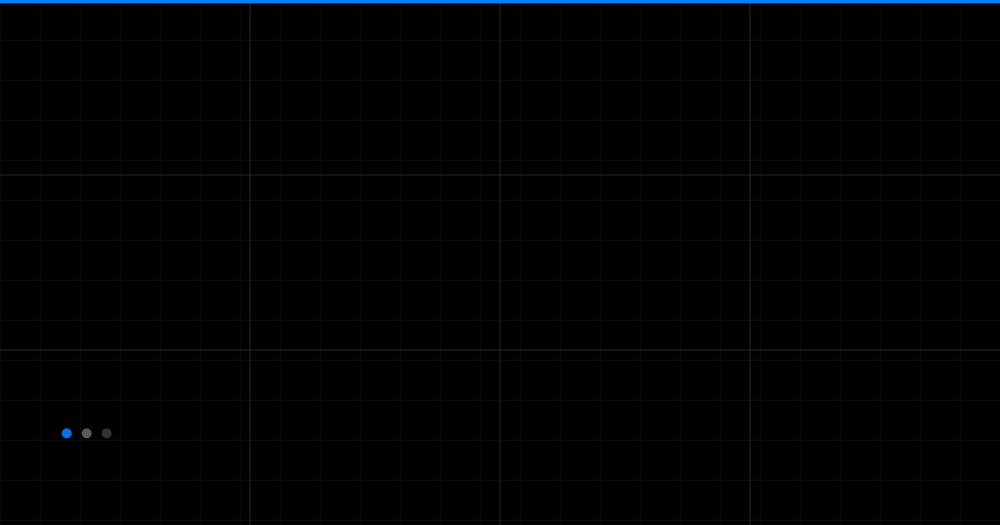

  

 

# Hi, I'm Gautham

### *I love creating things.*

 

I'm a **UI Developer** and **Technical Consultant** at **Adobe** — always exploring new tech, shipping design systems, and building **intuitive, user-first** experiences on the web.

 

